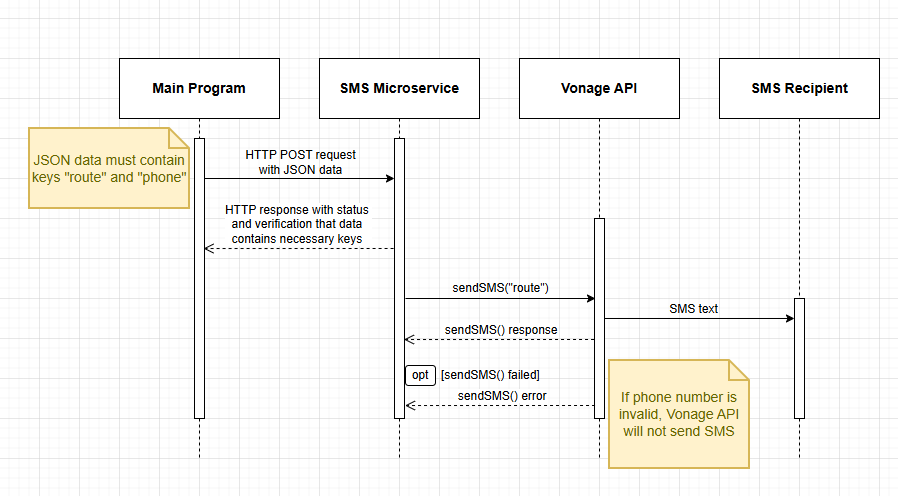

# SMS Alert Microservice

This program listens for HTTP post requests with a JSON object containing route and phone data, then sends route in an SMS message to the phone number provided. 


## Authors and Acknowledgements

- [@josebianchi7](https://github.com/josebianchi7/Portfolio)
- Glitch Web Hosting (https://glitch.com/)
- Vonage Communication and Network APIs (https://developer.vonage.com/en/home)


## Programmatically Request Data

To utilize this microservice to send data from a main program or other microservice to a phone number as a short message service (SMS) text, the requesting program must send an HTTP post request to the URL below with a JSON object that contains the keys 'route' and 'phone'.

URL: https://economic-rainy-numeric.glitch.me/sms-alert

Example call to request microservice to send data to a phone number (using Python):

1.  Import necessary library modules, store URL for where to send data, have data with a route and phone number to send.
```
import requests
import json

url = https://economic-rainy-numeric.glitch.me/sms-alert

data = {
    "route": "https://www.google.com/maps/dir/starting_latitude,starting_longitude/stop_1_latitude,stop_1_longitude/stop_2_latitude,stop_2_longitude/destination_latitude,destination_longitude/",
    "phone": "123-456-7890"
    } 
```
2. Send data as a JSON object via HTTP post request. Recommended to store response.
```
response = requests.post(url, json=data)
```


## Programmatically Receive Data

The microservice will transmit data in two ways. The first will be the HTTP response, and the second is the SMS message to the phone provided, if the phone number is a valid U.S. number. 

If the HTTP post request was stored in a variable as recommended, then the requestor can confirm the message was received, because the microservice will programmatically send back a JSON object with a string stating 'Data successfully received' and a response status code of 200. If a necessary data field such as 'route' or 'phone' is missing, then an error message stating 'Data missing required fields' will be sent instead and with a code of 400.


Example call to receive data from microservice (using Python):

Show response message and response status code in console.
```
if response.status_code == 200:
    print(f"\nServer Response: {response.json()}")
else:
    print(f"Failed to send message. Status code: {response.status_code}")
```


## UML Sequence Diagram



## Deployment Requirements

To deploy this project, the following is required:

### 1. Web Socket/ Web App Hosting Service with Node Version 15 or Higher

  Recommend Glitch with a Hello Node (blank) template. 

  If using Glitch, after creating template, update dependencies. For Glitch, must use version 16. Update node version in package.json:

  ```
  "node": "16.x"
  ```
  Add additional necessary dependencies:

  ```
  "dependencies": {
      "@vonage/server-sdk": "^3.19.4",
      "body-parser": "^2.1.0",
      "express": "^4.21.2",
      "handlebars": "^4.7.8",
      "nexmo": "^2.9.1",
      "nexmo-client": "^9.6.1",
      "ws": "^8.18.0"
    }
  ```

### 2. SMS API
  Recommend Vonage for its ease of use and free credits for testing. To use beyond testing or minimal use, a business account with sufficient funds to cover SMS messaging costs is needed. After making a Vonage account, the setup for SMS can be found on account dashboard or at https://developer.vonage.com/en/messages/concepts/sms.

  From Vonage account, store sensitive information below in Glitch or directory .env file.

| Parameter | Type     | Description                |
| :-------- | :------- | :------------------------- |
| `apiKey` | `string` | **Required**. Your API Key |
| `apiSecret` | `string` | **Required**. Your API Secret |
| `from` | `string` | **Required**. Your Vonage From number |

  Vonage provides basic code in popular programming languages to insert into your program. See example in socket/webSocket.js in this repository.

